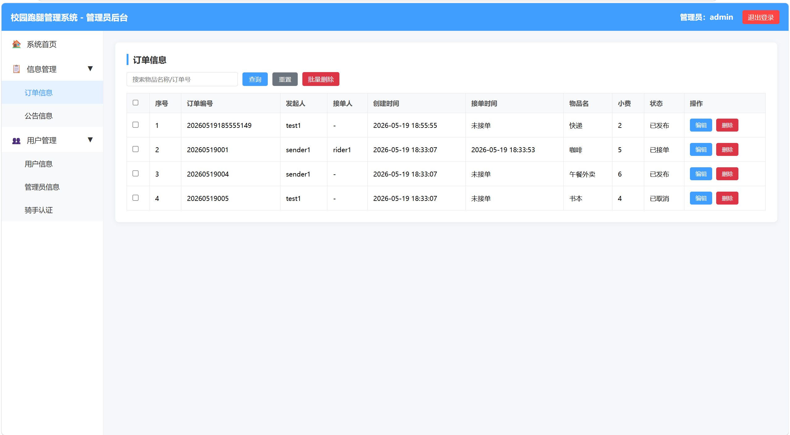
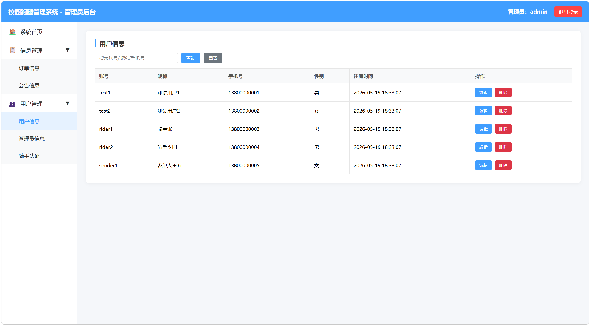
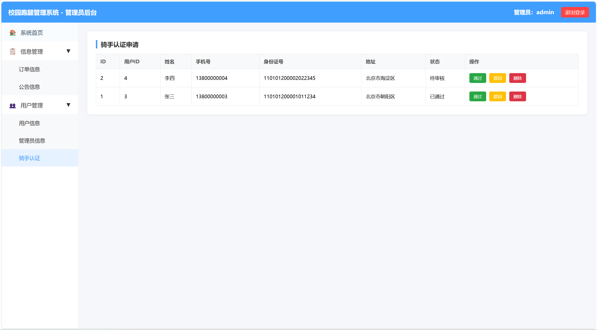

# 软件说明书

## 基本信息

**项目名称：**  
**学    院：** 计算机学院  
**小组序号：** 30  
**成员姓名：** 蒋奕婷 / 唐雪凝 / 周文瑶 / 宁钰莹  
**指导老师：** 尹兆远  
**当前版本：** 结项版  
**更新日期：** 2026年5月19日  

---

## 一、项目概述  

### 1. 项目背景
高校快递量激增，许多学生因各种原因无法及时取件；同时校园内存在一批有空闲时间、愿意通过跑腿赚取报酬的学生。目前缺乏专门的信息平台，双方需求无法有效匹配。本系统旨在搭建一个校园内的快递代取信息平台，让发布任务与接单更加便捷、规范。

### 2. 系统目标
开发一个快递代取跑腿管理系统，实现以下目标：
- 普通用户（学生）可发布取件订单、查看订单状态。
- 跑腿员可浏览未接订单、接单、更新配送进度、查看完成单数。
- 提供订单状态全流程跟踪（已发布→已接单→已完成）。
- 管理员模块可以对账户、订单等信息进行管理

### 3. 开发环境
- 开发工具：VS Code / IntelliJ IDEA
- 运行环境：JDK 17 + MySQL 8.0 + Windows
- 数据库：mysql

---

## 二、需求分析  

### 1. 功能需求
- **用户模块**：注册、登录，区分普通用户与跑腿员。
- **订单模块**：发布订单（地点、物品、备注）；跑腿员浏览未接订单并接单（一个订单只能一人接，不能自己接自己的订单）；更新订单进度；未接订单可取消。
- **结算模块**：用户查看个人订单状态，骑手中心查看个人接单记录。
- **管理员模块**：对账户、订单等信息进行管理。

主要业务流程：
1. 普通用户注册登录后发布订单（地点、物品、备注）。
2. 跑腿员登录后浏览未接订单列表，选择一个订单接单。
3. 跑腿员更新订单状态。
4. 跑腿员可在骑手中心查看个人接单记录。

### 2. 非功能需求
- **性能要求**：页面响应时间 ≤ 2秒，支持并发 ≤ 50用户。
- **安全要求**：用户密码加密存储，防止SQL注入。
- **兼容性要求**：推荐使用Chrome或Edge浏览器访问。

---

## 三、系统设计  

### 1. 系统架构
系统采用前后端分离架构，整体分为三层：前端 UI 层、后端业务层、数据库层。
- **前端 UI 层**：负责页面展示与用户交互，包括用户端页面和管理员后台页面。前端通过 HTTP 请求调用后端接口，数据交换格式为 JSON。
- **后端业务层**：基于 Spring Boot 框架开发，内部采用分层设计：
  - **Controller 层**：接收前端请求，校验参数，调用 Service 层并返回 JSON 数据。
  - **Service 层**：处理业务逻辑（如分页查询、模糊搜索、数据校验），调用 Mapper 层操作数据库。
  - **Mapper 层**：通过 MyBatis-Plus 与数据库交互，无需手写 SQL 即可完成增删改查。
  后端按业务功能划分为用户管理和订单管理两个模块。订单管理模块依赖用户管理模块，因为订单的发起人和接单人都必须来源于用户表。
- **数据库层**：使用 MySQL 关系型数据库，存储管理员、用户、订单等数据。后端通过 JDBC 连接池（HikariCP）管理数据库连接，MyBatis-Plus 自动生成并执行 SQL 语句。  


### 2. 模块设计

- **用户管理模块**：负责管理员和普通用户的增删改查，为订单模块提供人员数据支撑。
- **订单管理模块**：负责订单的发布、接单、状态跟踪。订单中的“发起人”和“接单人”字段关联用户表中的用户ID。
- **模块依赖关系**：订单模块依赖用户模块。创建订单时需校验发起人是否存在，接单时需校验接单人是否存在。用户模块是基础，订单模块是核心业务。

### 3. 数据库设计
- E-R 图  

- 主要数据表设计  
1. 管理员表 `users`

| 字段名     | 数据类型     | 约束         | 说明       |
|------------|--------------|--------------|------------|
| id         | bigint(20)   | 主键自增     | 主键ID     |
| username   | varchar(100) | 非空         | 用户名     |
| password   | varchar(100) | 非空         | 密码       |
| role       | varchar(100) | 默认管理员   | 角色       |
| addtime    | timestamp    | 默认当前时间 | 创建时间   |

2. 学生用户表 `xuesheng`

| 字段名          | 数据类型     | 约束         | 说明       |
|-----------------|--------------|--------------|------------|
| id              | bigint(20)   | 主键自增     | 主键ID     |
| addtime         | timestamp    | 默认当前时间 | 创建时间   |
| xueshengxuehao  | varchar(200) | 唯一非空     | 学生学号   |
| mima            | varchar(200) | 非空         | 密码       |
| xueshengxingming| varchar(200) | 非空         | 学生姓名   |
| xingbie         | varchar(200) | 可空         | 性别       |
| lianxidianhua   | varchar(200) | 可空         | 联系电话   |
| didian          | varchar(200) | 可空         | 地点/宿舍  |
| touxiang        | longtext     | 可空         | 头像       |

3. 兼职人员（骑手）表 `jianzhirenyuan`

| 字段名     | 数据类型     | 约束         | 说明       |
|------------|--------------|--------------|------------|
| id         | bigint(20)   | 主键自增     | 主键ID     |
| addtime    | timestamp    | 默认当前时间 | 创建时间   |
| zhanghao   | varchar(200) | 唯一非空     | 账号       |
| mima       | varchar(200) | 非空         | 密码       |
| xingming   | varchar(200) | 非空         | 姓名       |
| xingbie    | varchar(200) | 可空         | 性别       |
| dianhua    | varchar(200) | 可空         | 电话       |
| touxiang   | longtext     | 可空         | 头像       |
| sfsh       | varchar(200) | 默认待审核   | 是否审核   |
| shhf       | longtext     | 可空         | 审核回复   |

4. 跑腿订单表 `paotuidingdan`

| 字段名          | 数据类型     | 约束     | 说明       |
|-----------------|--------------|----------|------------|
| id              | bigint(20)   | 主键自增 | 主键ID     |
| addtime         | timestamp    | 默认当前时间 | 创建时间 |
| dingdanbianhao  | varchar(200) | 唯一     | 订单编号   |
| biaoti          | varchar(200) | 可空     | 标题       |
| tupian          | longtext     | 可空     | 图片       |
| choulao         | double       | 可空     | 酬劳       |
| xueshengxuehao  | varchar(200) | 可空     | 学生学号   |
| xueshengxingming| varchar(200) | 可空     | 学生姓名   |
| didian          | varchar(200) | 可空     | 地点       |
| dingdanleixing  | varchar(200) | 可空     | 订单类型   |
| fabushijian     | date         | 可空     | 发布时间   |
| paotuixuqiu     | longtext     | 可空     | 跑腿需求   |

5. 跑腿接单表 `paotuijiedan`

| 字段名          | 数据类型     | 约束     | 说明         |
|-----------------|--------------|----------|--------------|
| id              | bigint(20)   | 主键自增 | 主键ID       |
| addtime         | timestamp    | 默认当前时间 | 创建时间   |
| dingdanbianhao  | varchar(200) | 可空     | 订单编号     |
| biaoti          | varchar(200) | 可空     | 标题         |
| choulao         | varchar(200) | 可空     | 酬劳         |
| xueshengxuehao  | varchar(200) | 可空     | 学生学号     |
| xueshengxingming| varchar(200) | 可空     | 学生姓名     |
| didian          | varchar(200) | 可空     | 地点         |
| jiedanleixing   | varchar(200) | 可空     | 接单类型     |
| jiedanshijian   | date         | 可空     | 接单时间     |
| jiedanbeizhu    | longtext     | 可空     | 接单备注     |
| zhanghao        | varchar(200) | 可空     | 骑手账号     |
| xingming        | varchar(200) | 可空     | 骑手姓名     |
| dianhua         | varchar(200) | 可空     | 骑手电话     |

6. 订单配送表 `dingdanpeisong`

| 字段名          | 数据类型     | 约束     | 说明       |
|-----------------|--------------|----------|------------|
| id              | bigint(20)   | 主键自增 | 主键ID     |
| addtime         | timestamp    | 默认当前时间 | 创建时间 |
| dingdanbianhao  | varchar(200) | 可空     | 订单编号   |
| biaoti          | varchar(200) | 可空     | 标题       |
| choulao         | varchar(200) | 可空     | 酬劳       |
| xueshengxuehao  | varchar(200) | 可空     | 学生学号   |
| xueshengxingming| varchar(200) | 可空     | 学生姓名   |
| didian          | varchar(200) | 可空     | 地点       |
| peisongleixing  | varchar(200) | 可空     | 配送类型   |
| peisongshijian  | date         | 可空     | 配送时间   |
| zhanghao        | varchar(200) | 可空     | 骑手账号   |
| xingming        | varchar(200) | 可空     | 骑手姓名   |
| dianhua         | varchar(200) | 可空     | 骑手电话   |
| xiangqing       | longtext     | 可空     | 配送详情   |

7. 订单签收表 `dingdanqianshou`

| 字段名          | 数据类型     | 约束         | 说明       |
|-----------------|--------------|--------------|------------|
| id              | bigint(20)   | 主键自增     | 主键ID     |
| addtime         | timestamp    | 默认当前时间 | 创建时间   |
| dingdanbianhao  | varchar(200) | 可空         | 订单编号   |
| biaoti          | varchar(200) | 可空         | 标题       |
| choulao         | varchar(200) | 可空         | 酬劳       |
| xueshengxuehao  | varchar(200) | 可空         | 学生学号   |
| xueshengxingming| varchar(200) | 可空         | 学生姓名   |
| didian          | varchar(200) | 可空         | 地点       |
| qianshoushijian | date         | 可空         | 签收时间   |
| zhanghao        | varchar(200) | 可空         | 骑手账号   |
| xingming        | varchar(200) | 可空         | 骑手姓名   |
| dianhua         | varchar(200) | 可空         | 骑手电话   |
| ispay           | varchar(200) | 默认未支付   | 是否支付   |

8. 服务评价表 `fuwupingjia`

| 字段名          | 数据类型     | 约束     | 说明         |
|-----------------|--------------|----------|--------------|
| id              | bigint(20)   | 主键自增 | 主键ID       |
| addtime         | timestamp    | 默认当前时间 | 创建时间   |
| dingdanbianhao  | varchar(200) | 可空     | 订单编号     |
| biaoti          | varchar(200) | 可空     | 标题         |
| xueshengxuehao  | varchar(200) | 可空     | 学生学号     |
| xueshengxingming| varchar(200) | 可空     | 学生姓名     |
| didian          | varchar(200) | 可空     | 地点         |
| manyidu         | varchar(200) | 可空     | 满意度       |
| fuwupingfen     | varchar(200) | 可空     | 服务评分     |
| pingjiashijian  | date         | 可空     | 评价时间     |
| fuwupingjia     | longtext     | 可空     | 服务评价内容 |
| zhanghao        | varchar(200) | 可空     | 骑手账号     |
| xingming        | varchar(200) | 可空     | 骑手姓名     |
| dianhua         | varchar(200) | 可空     | 骑手电话     |

9. 交流论坛表 `forum`

| 字段名     | 数据类型     | 约束     | 说明       |
|------------|--------------|----------|------------|
| id         | bigint(20)   | 主键自增 | 主键ID     |
| addtime    | timestamp    | 默认当前时间 | 创建时间 |
| title      | varchar(200) | 可空     | 帖子标题   |
| content    | longtext     | 非空     | 帖子内容   |
| parentid   | bigint(20)   | 可空     | 父节点ID   |
| userid     | bigint(20)   | 非空     | 用户ID     |
| username   | varchar(200) | 可空     | 用户名     |
| avatarurl  | longtext     | 可空     | 头像       |
| isdone     | varchar(200) | 可空     | 状态       |

10. 在线留言表 `zaixianliuyan`

| 字段名          | 数据类型     | 约束     | 说明         |
|-----------------|--------------|----------|--------------|
| id              | bigint(20)   | 主键自增 | 主键ID       |
| addtime         | timestamp    | 默认当前时间 | 创建时间   |
| biaoti          | varchar(200) | 可空     | 标题         |
| xueshengxuehao  | varchar(200) | 可空     | 学生学号     |
| xueshengxingming| varchar(200) | 可空     | 学生姓名     |
| liuyanshijian   | date         | 可空     | 留言时间     |
| liuyanneirong   | longtext     | 可空     | 留言内容     |
| zhanghao        | varchar(200) | 可空     | 回复人账号   |
| xingming        | varchar(200) | 可空     | 回复人姓名   |
| shhf            | longtext     | 可空     | 管理员回复   |

11. 公告信息表 `news`

| 字段名        | 数据类型     | 约束     | 说明       |
|---------------|--------------|----------|------------|
| id            | bigint(20)   | 主键自增 | 主键ID     |
| addtime       | timestamp    | 默认当前时间 | 创建时间 |
| title         | varchar(200) | 非空     | 标题       |
| introduction  | longtext     | 可空     | 简介       |
| picture       | longtext     | 非空     | 封面图片   |
| content       | longtext     | 非空     | 内容       |

12. 关于我们表 `aboutus`

| 字段名     | 数据类型     | 约束     | 说明       |
|------------|--------------|----------|------------|
| id         | bigint(20)   | 主键自增 | 主键ID     |
| addtime    | timestamp    | 默认当前时间 | 创建时间 |
| title      | varchar(200) | 非空     | 标题       |
| subtitle   | varchar(200) | 可空     | 副标题     |
| content    | longtext     | 非空     | 内容       |
| picture1   | longtext     | 可空     | 图片1      |
| picture2   | longtext     | 可空     | 图片2      |
| picture3   | longtext     | 可空     | 图片3      |

13. 系统配置表 `config`

| 字段名 | 数据类型     | 约束     | 说明       |
|--------|--------------|----------|------------|
| id     | bigint(20)   | 主键自增 | 主键ID     |
| name   | varchar(100) | 非空     | 配置名称   |
| value  | varchar(100) | 可空     | 配置值     |

14. 登录令牌表 `token`

| 字段名        | 数据类型     | 约束         | 说明       |
|---------------|--------------|--------------|------------|
| id            | bigint(20)   | 主键自增     | 主键ID     |
| userid        | bigint(20)   | 非空         | 用户ID     |
| username      | varchar(100) | 非空         | 用户名     |
| tablename     | varchar(100) | 可空         | 表名       |
| role          | varchar(100) | 可空         | 角色       |
| token         | varchar(200) | 非空         | 令牌       |
| addtime       | timestamp    | 默认当前时间 | 创建时间   |
| expiratedtime | timestamp    | 默认当前时间 | 过期时间   |

**实体关系说明**

1. **学生** (1) → (N) **跑腿订单**：一个学生可发布多个跑腿订单  
2. **兼职人员** (1) → (N) **跑腿接单**：一个骑手可承接多个订单  
3. **跑腿订单** (1) : (1) **跑腿接单**：一个订单只能被一个骑手接单  
4. **跑腿接单** (1) : (1) **订单配送**：接单后自动生成配送记录  
5. **订单配送** (1) : (1) **订单签收**：配送完成生成签收记录  
6. **订单签收** (1) : (1) **服务评价**：签收后学生可对骑手评价  
7. 学生、骑手均可发布论坛、留言  
8. 管理员负责管理公告、配置、审核骑手信息

---

## 四、系统实现  

### 1. 关键技术
#### 后端部分
| 技术名称 | 用途说明 |
|----------|----------|
| Spring Boot | 项目基础框架，简化Spring应用的搭建和配置 |
| MyBatis-Plus | 数据库操作框架，无需手写SQL即可完成增删改查和分页 |
| RESTful API | 前后端通信规范，使用GET/POST/PUT/DELETE对应查/增/改/删 |
| HikariCP连接池 | Spring Boot默认数据库连接池，管理数据库连接 |
| Lombok | 简化实体类代码，自动生成getter/setter |
| 统一返回格式Result | 封装后端返回的JSON数据，保证code/message/data结构一致 |

#### 前端部分
**（一）前端页面开发技术**
1. 基础页面构建技术：采用 HTML5 语义化标签（`<header>`、`<section>`、`<form>`等），搭建系统首页、登录页、个人中心等核心页面的结构框架，保证页面结构清晰、可维护性强。
2. CSS 美化技术：运用 CSS3 特性（阴影、圆角、弹性布局），实现统一的 UI 风格；通过固定标签宽度、设置 `white-space: nowrap` 等属性，解决文字换行、排版错乱问题。
3. 交互逻辑实现技术：采用分步式交互设计，通过 JS 控制页面显示与切换，实现业务类型选择、表单提交、页面跳转等交互效果。

**（二）核心样式与布局技术**
1. 卡片式布局技术：运用 CSS 弹性布局（Flexbox），实现页面元素居中、对齐，解决表单标签单行显示、按钮间距优化等问题。
2. 响应式与一致性样式技术：通过统一的 CSS 样式定义（导航栏、卡片样式、按钮样式），保证所有页面 UI 风格统一。

**（三）前端交互与功能实现技术**
1. 表单交互技术：设计表单验证、下拉选择、按钮点击等基础交互，实现输入框、下拉菜单、文本域等元素的美观呈现。
2. 分步交互技术：采用分步式页面设计，通过 JS 控制不同业务页面的显示与切换，避免字段混杂，提升用户操作体验。

#### 数据库部分
**技术选型**
- MySQL：稳定开源的关系型数据库，支持事务、外键约束与索引优化，适配校园业务场景。
- MyBatis-Plus：基于 MyBatis 的增强框架，提供通用 CRUD、条件构造器、分页插件等功能，减少手写 SQL 代码量，提升开发效率。
- Spring 事务管理：依托 Spring 声明式事务，保证订单创建、状态更新等多步操作的数据一致性，避免脏数据产生。

### 2. 界面展示

以下为部分核心功能的界面展示

- 系统首页界面，可选登录、查看公告


- 用户登录界面，可以登录账号，或者跳转注册账号页面


- 用户注册界面，可注册新账号


- 登录成功后首页界面


- 发布跑腿订单界面，可填写对应信息后发布订单

 

- 个人订单查看页面，可查看当前订单状态，或取消未接单的订单


- 骑手认证界面，可填写对应信息申请成为骑手


- 骑手接单页面，可浏览待接订单信息、选择接取订单


- 骑手订单记录页面，可浏览接取的订单记录、修改订单状态


- 管理员后台界面，可操作各项管理内容，包括编辑或删除订单信息、用户信息，审批骑手认证等







### 3. 核心代码片段

#### 后端代码片段

**片段一：业务层分页查询（AdminServiceImpl.java）**  
说明：该方法位于 Service 层，负责管理员列表的分页查询和模糊搜索，体现了 MyBatis-Plus 无需手写 SQL 即可完成复杂查询。
```java
@Service
public class AdminServiceImpl extends ServiceImpl<AdminMapper, Admin> 
        implements IAdminService {
    @Override
    public Page<Admin> getAdminPage(int pageNum, int pageSize, 
                                    String username, String nickname) {
        // 构建查询条件包装器
        LambdaQueryWrapper<Admin> wrapper = new LambdaQueryWrapper<>();
        // 按账号模糊搜索（若前端传了值）
        wrapper.like(StringUtils.hasText(username), Admin::getUsername, username);
        // 按姓名模糊搜索（若前端传了值）
        wrapper.like(StringUtils.hasText(nickname), Admin::getNickname, nickname);
        // 按创建时间倒序排列
        wrapper.orderByDesc(Admin::getCreateTime);
        // 创建分页对象，pageNum当前页，pageSize每页条数
        Page<Admin> page = new Page<>(pageNum, pageSize);
        return this.page(page, wrapper);
    }
}
```
**片段二：控制器层管理员接口（AdminController.java）**  
说明：该接口遵循 RESTful 风格，处理前端 GET 请求，调用 Service 获取分页数据，并返回统一 JSON 格式。
```java
@RestController
@RequestMapping("/api/admin")
public class AdminController {
    @Autowired
    private IAdminService adminService;

    @GetMapping("/list")
    public Result<Page<Admin>> list(
            @RequestParam(defaultValue = "1") Integer pageNum,
            @RequestParam(defaultValue = "10") Integer pageSize,
            @RequestParam(required = false) String username,
            @RequestParam(required = false) String nickname) {
        // 调用 Service 分页查询，并用统一返回类封装
        Page<Admin> page = adminService.getAdminPage(pageNum, pageSize, 
                                                    username, nickname);
        return Result.success(page);
    }
}
```
**片段三：数据库连接与 MyBatis-Plus 配置（application.yml）**  
说明：该配置文件定义了后端项目连接 MySQL 数据库的参数，以及 MyBatis-Plus 的实体扫描和 SQL 日志输出，是项目启动的基础。
```yaml
spring:
  datasource:
    driver-class-name: com.mysql.cj.jdbc.Driver
    url: jdbc:mysql://localhost:3306/errandd?useSSL=false&serverTimezone=Asia/Shanghai&characterEncoding=UTF-8
    username: root
    password: 12345

mybatis-plus:
  configuration:
    log-impl: org.apache.ibatis.logging.stdout.StdOutImpl  # 控制台打印SQL，调试用
  type-aliases-package: com.example.errand3.entity          # 实体类包路径
```

**片段四：统一返回结果类 Result.java**  
说明：定义后端返回给前端的统一 JSON 格式，包含状态码、提示信息和数据体。

```java
package com.example.errand3.common;

import lombok.Data;

@Data
public class Result<T> {
    private int code;        // 状态码：200成功，500失败
    private String message;  // 提示信息
    private T data;          // 返回数据

    public Result() {}
    public Result(int code, String message, T data) {
        this.code = code; this.message = message; this.data = data;
    }

    public static <T> Result<T> success(T data) {
        return new Result<>(200, "操作成功", data);
    }
    public static <T> Result<T> success() { return success(null); }
    public static <T> Result<T> error(String msg) {
        return new Result<>(500, msg, null);
    }
}
```

**片段五：订单分页查询 OrderInfoServiceImpl.java**  
说明：使用 MyBatis-Plus 的 LambdaQueryWrapper 构建条件，无需写 SQL 即可实现分页、模糊搜索和多条件筛选。

```java
@Override
public Page<OrderInfo> getOrderPage(int pageNum, int pageSize,
                                    String orderNo, String goodsName,
                                    String status, Long senderId) {
    LambdaQueryWrapper<OrderInfo> wrapper = new LambdaQueryWrapper<>();
    // 按订单编号模糊搜索
    wrapper.like(StringUtils.hasText(orderNo), OrderInfo::getOrderNo, orderNo);
    // 按物品名称模糊搜索
    wrapper.like(StringUtils.hasText(goodsName), OrderInfo::getGoodsName, goodsName);
    // 按状态精确匹配
    wrapper.eq(StringUtils.hasText(status), OrderInfo::getStatus, status);
    // 按发起人ID精确匹配
    wrapper.eq(senderId != null, OrderInfo::getSenderId, senderId);
    // 按创建时间倒序排列
    wrapper.orderByDesc(OrderInfo::getCreateTime);
    // 执行分页查询
    return this.page(new Page<>(pageNum, pageSize), wrapper);
}
```

**片段六：登录接口（统一登录） AuthController.java**  
说明：先查管理员表，查不到再查用户表，返回角色信息，前端据此跳转不同页面。

```java
@PostMapping("/login")
public Result<?> login(@RequestBody Map<String, String> params) {
    String username = params.get("username");
    String password = params.get("password");

    // 1. 先查管理员表
    LambdaQueryWrapper<Admin> adminWrapper = new LambdaQueryWrapper<>();
    adminWrapper.eq(Admin::getUsername, username)
               .select(Admin::getId, Admin::getUsername, Admin::getPassword,
                       Admin::getNickname, Admin::getRole);
    Admin admin = adminService.getOne(adminWrapper);
    if (admin != null) {
        if (admin.getPassword().equals(password)) {
            Map<String, Object> info = new HashMap<>();
            info.put("id", admin.getId());
            info.put("username", admin.getUsername());
            info.put("nickname", admin.getNickname());
            info.put("role", admin.getRole());
            return Result.success(info);
        } else { return Result.error("密码错误"); }
    }

    // 2. 再查普通用户表（显式包含密码字段）
    LambdaQueryWrapper<User> userWrapper = new LambdaQueryWrapper<>();
    userWrapper.eq(User::getUsername, username)
              .select(User::getId, User::getUsername, User::getPassword,
                      User::getNickname, User::getGender);
    User user = userService.getOne(userWrapper);
    if (user != null) {
        if (user.getPassword().equals(password)) {
            Map<String, Object> info = new HashMap<>();
            info.put("id", user.getId());
            info.put("username", user.getUsername());
            info.put("nickname", user.getNickname());
            info.put("gender", user.getGender());
            info.put("role", "USER");
            return Result.success(info);
        } else { return Result.error("密码错误"); }
    }

    return Result.error("账号不存在");
}
```

**片段七：接单校验骑手认证 OrderInfoController.java**  
说明：修改订单时，如果传入 runnerId（即接单操作），先查询认证表，确认该用户已通过审核才允许接单。
```java
@PutMapping
public Result<?> update(@RequestBody OrderInfo order) {
    // 接单前校验骑手认证
    if (order.getRunnerId() != null) {
        LambdaQueryWrapper<Certification> certWrapper = new LambdaQueryWrapper<>();
        certWrapper.eq(Certification::getUserId, order.getRunnerId())
                   .eq(Certification::getStatus, "通过");
        Certification cert = certificationService.getOne(certWrapper);
        if (cert == null) {
            return Result.error("您尚未通过骑手认证，无法接单");
        }
    }

    // 如果状态为"已接单"，自动填入接单时间
    if ("已接单".equals(order.getStatus())) {
        order.setAcceptTime(LocalDateTime.now());
    }

    orderService.updateById(order);
    return Result.success();
}
```

**片段八：跨域配置 CorsConfig.java**  
说明：允许前端在不同端口访问后端接口，解决浏览器同源策略限制。

```java
@Configuration
public class CorsConfig {
    @Bean
    public CorsFilter corsFilter() {
        CorsConfiguration config = new CorsConfiguration();
        config.addAllowedOriginPattern("*");  // 允许所有来源
        config.addAllowedMethod("*");         // 允许所有HTTP方法
        config.addAllowedHeader("*");         // 允许所有请求头
        config.setAllowCredentials(true);     // 允许携带凭证
        UrlBasedCorsConfigurationSource source = new UrlBasedCorsConfigurationSource();
        source.registerCorsConfiguration("/**", config);
        return new CorsFilter(source);
    }
}
```


#### 前端代码片段

**片段一**  
订单列表渲染与状态控制（骑手接单页）// 渲染订单列表，根据状态自动控制按钮
```
function renderMyOrders(list) {
    let html = "";
    list.forEach(o => {
        // 直接读取后端状态
        let orderStatus = o.state || o.status || "未知状态";
        let tipColor = orderStatus === "已完成" ? "#28a745" : "#409eff";
        
        // 动态生成按钮：接单/完成/禁用
        let finishBtn = "";
        if (orderStatus === "已接单") {
            finishBtn = `<button class="btn-finish" onclick="finishOrder(${o.id})">确认完成</button>`;
        } else if (orderStatus === "已完成") {
            finishBtn = `<button class="btn-finish" disabled>已完成</button>`;
        }
        
        html += `
        <div class="order-card">
            <div class="info-left">
                <h4>物品：${o.goodsName}</h4>
                <p>订单号：${o.id}</p>
                <p>小费：<span class="tip">${o.tip} 元</span></p>
                <p>状态：<span style="color:${tipColor}">${orderStatus}</span></p>
            </div>
            <div class="btn-group">
                <button class="btn-detail" onclick="showOrderDetail(${o.id})">详情</button>
                ${finishBtn}
            </div>
        </div>`;
    });
    document.getElementById("myOrderList").innerHTML = html;
}
```
**片段二**  
订单状态更新（接单 / 完成）// 骑手接单接口请求
```
function takeOrder(orderId) {
    if (!confirm("确定要接此订单吗？")) return;

    // 标记本地已接单，防止重复请求
    takenOrderIds.add(orderId);
    const btn = document.getElementById(`takeBtn-${orderId}`);
    if (btn) {
        btn.disabled = true;
        btn.innerText = "接单中...";
    }

    // 发送PUT请求更新订单状态
    fetch(baseUrl + "/api/order", {
        method: "PUT",
        headers: { "Content-Type": "application/json" },
        body: JSON.stringify({
            id: orderId,
            runner_id: user.id,
            state: "已接单"
        })
    })
    .then(res => res.json())
    .then(res => {
        alert("接单成功！");
        loadAllOrders();
        loadMyTakeOrders();
    });
}

// 订单完成接口请求
function finishOrder(orderId) {
    if (!confirm("确认订单已完成？")) return;
    fetch(baseUrl + "/api/order", {
        method: "PUT",
        headers: { "Content-Type": "application/json" },
        body: JSON.stringify({
            id: orderId,
            state: "已完成"
        })
    })
    .then(res => res.json())
    .then(res => {
        alert("订单已完成！");
        loadMyTakeOrders();
    });
}// 骑手接单接口请求
function takeOrder(orderId) {
    if (!confirm("确定要接此订单吗？")) return;

    // 标记本地已接单，防止重复请求
    takenOrderIds.add(orderId);
    const btn = document.getElementById(`takeBtn-${orderId}`);
    if (btn) {
        btn.disabled = true;
        btn.innerText = "接单中...";
    }

    // 发送PUT请求更新订单状态
    fetch(baseUrl + "/api/order", {
        method: "PUT",
        headers: { "Content-Type": "application/json" },
        body: JSON.stringify({
            id: orderId,
            runner_id: user.id,
            state: "已接单"
        })
    })
    .then(res => res.json())
    .then(res => {
        alert("接单成功！");
        loadAllOrders();
        loadMyTakeOrders();
    });
}

// 订单完成接口请求
function finishOrder(orderId) {
    if (!confirm("确认订单已完成？")) return;
    fetch(baseUrl + "/api/order", {
        method: "PUT",
        headers: { "Content-Type": "application/json" },
        body: JSON.stringify({
            id: orderId,
            state: "已完成"
        })
    })
    .then(res => res.json())
    .then(res => {
        alert("订单已完成！");
        loadMyTakeOrders();
    });
}
```

---

## 五、系统测试

### 1. 测试方案

**测试目的**  
全面检测校园跑腿系统各项业务功能是否正常运行，验证用户下单、跑腿员接单、订单流转等核心流程是否通顺，排查系统使用过程中的错误与漏洞，确保系统稳定流畅，满足校园日常跑腿服务使用需求。

**测试人员**  
测试成员

**测试环境**  
- 操作系统：Windows  
- 运行环境：项目本地启动环境  
- 数据库：MySQL  
- 测试浏览器：主流网页浏览器  
- 网络环境：正常局域网、校园网络  

**测试范围**  
1. 用户端：注册登录、个人信息管理、发布跑腿订单、订单查看、订单取消、确认收货  
2. 跑腿员端：账号登录、订单浏览、订单接单、配送完成、收益查看  
3. 核心业务：完整下单-接单-配送-完成全业务流程  
4. 基础功能：页面跳转、信息录入、操作提示、数据加载  

**非测试范围**  
1. 高并发压力测试、大型服务器性能测试  
2. 真实线上支付转账功能测试  
3. 系统底层代码优化与架构优化  
4. 页面外观精细化美化调试  

**主要测试内容**  
- 登录注册测试：正常/异常登录、新用户注册、退出登录  
- 用户下单功能测试：正常发布、空内容/违规内容拦截  
- 订单管理测试：个人订单查看、分类展示、取消订单  
- 跑腿员功能测试：登录接单界面、浏览待接订单、接单、状态更新、完成配送  
- 全流程业务测试：发布→接单→配送→确认完成，状态无错乱   
- 异常场景测试：未登录限制、重复提交、页面刷新数据保留  

**测试方法**  
采用手工黑盒测试，模拟真实师生使用场景，手动操作系统所有功能，逐项记录使用情况、功能问题与系统异常。

**测试流程**  
1. 熟悉系统整体功能与业务逻辑  
2. 分模块逐项开展单项功能测试  
3. 完成整体业务流程联合测试  
4. 记录测试问题、BUG与异常情况  
5. 提交问题交由开发人员修复  
6. 问题修复完成后进行复测验证  
7. 汇总整理所有测试资料完成测试  

**测试用例**

登录注册模块
| 用例编号 | 测试功能 | 前置条件 | 测试步骤 | 预期结果 |
| ---- | ---- | ---- | ---- | ---- |
| LOG001 | 正确账号密码登录 | 已注册普通用户账号 | 1.进入系统登录页面<br>2.输入正确账号、密码<br>3.点击登录按钮 | 登录成功，跳转系统首页 |
| LOG002 | 错误账号登录 | 无 | 1.输入不存在账号<br>2.输入任意密码登录 | 系统提示账号不存在 |
| LOG003 | 错误密码登录 | 拥有合法账号 | 1.输入正确账号<br>2.输入错误密码登录 | 系统提示密码输入错误 |
| REG001 | 普通用户注册 | 无 | 1.打开注册页面<br>2.填写完整个人信息<br>3.提交注册信息 | 注册成功，自动跳转登录页 |
| REG002 | 跑腿员身份注册 | 无 | 1.进入注册界面<br>2.选择跑腿员身份<br>3.填写信息完成注册 | 注册成功，身份标识为跑腿员 |

用户发布订单模块
| 用例编号 | 测试功能 | 前置条件 | 测试步骤 | 预期结果 |
| ---- | ---- | ---- | ---- | ---- |
| ORDER001 | 正常发布跑腿订单 | 普通用户已登录系统 | 1.进入发布订单页面<br>2.填写取件地址、送达地址、物品信息、跑腿酬金<br>3.提交订单 | 订单发布成功，状态为待接单 |
| ORDER002 | 空表单提交订单 | 用户已登录 | 不填写任何信息直接提交订单 | 系统提示必填项不能为空，禁止提交 |
| ORDER003 | 取消未接单订单 | 存在待接单订单 | 1.进入个人发布订单列表<br>2.选中订单点击取消 | 订单状态变更为已取消 |
| ORDER004 | 查看个人发布订单 | 已发布多条订单 | 点击我的发布订单选项 | 展示本人所有发布订单及状态 |

跑腿员接单模块
| 用例编号 | 测试功能 | 前置条件 | 测试步骤 | 预期结果 |
| ---- | ---- | ---- | ---- | ---- |
| TAKE001 | 查看公共订单列表 | 跑腿员账号登录 | 进入接单大厅页面 | 展示平台所有待接单订单 |
| TAKE002 | 成功认领订单 | 平台存在待接单订单 | 1.选择意向订单<br>2.点击接单并确认 | 订单状态改为已接单 |
| TAKE003 | 重复接单测试 | 订单已被他人接单 | 其他跑腿员点击已被接订单 | 无法接单，提示订单已被认领 |
| TAKE004 | 更新订单配送状态 | 已成功接单 | 跑腿员修改订单为已取件、配送中 | 订单状态实时同步更新 |
| TAKE005 | 订单完成确认 | 物品已送达目的地 | 发布用户确认收货完成 | 订单状态变更为已完成 |

权限控制测试
| 用例编号 | 测试功能 | 前置条件 | 测试步骤 | 预期结果 |
| ---- | ---- | ---- | ---- | ---- |
| AUTH001 | 未登录访问系统首页 | 未登录任何账号 | 直接输入网址访问系统主页 | 强制跳转登录页面 |
| AUTH002 | 普通用户访问接单页面 | 普通用户登录 | 点击跑腿接单功能入口 | 无访问权限，禁止进入 |
| AUTH003 | 跑腿员发布需求订单 | 跑腿员账号登录 | 进入订单发布页面发布订单 | 可正常发布用户需求订单 | 

异常数据测试
| 用例编号 | 测试功能 | 前置条件 | 测试步骤 | 预期结果 |
| ---- | ---- | ---- | ---- | ---- |
| ERR001 | 填写负数跑腿酬金 | 用户发布订单 | 酬金栏填写负数金额提交 | 拦截提交，提示金额输入非法 |
| ERR002 | 超长备注信息提交 | 用户发布订单 | 备注栏输入大量文字内容 | 系统限制字数，可正常提交 |

---

### 2. 测试结果

**整体测试结论**  
本次完成系统全部既定测试范围内容，系统绝大多数基础功能与核心跑腿业务均可正常使用，页面跳转、信息录入、数据存储、订单状态流转基本稳定，错误操作具备对应提示提醒，未出现系统崩溃、大面积功能失效等严重问题。现存少量轻微功能瑕疵与数据显示问题，待开发优化修复后，系统可满足校园跑腿日常使用需求。

**各模块详细测试结果**

**4.1 登录注册测试结果**  
1. 正常账号密码可顺利登录系统，跳转对应功能首页，运行正常  
2. 新用户填写完整注册信息可成功提交注册，账号创建生效  
3. 输入错误账号、错误密码时，系统弹出清晰错误提示，无法登录  
4. 退出登录功能可正常使用，成功退回登录页面  
5. 未登录状态无法进入下单、接单等核心功能页面，权限拦截有效  
**测试结果：全部功能通过测试**

**4.2 用户下单功能测试结果**  
1. 完整填写取件地址、收货地址、物品信息、跑腿费用后，可成功发布跑腿订单  
2. 空白信息、必填项未填写时，系统进行拦截并弹窗提醒补充内容  
3. 违规文字、无效内容无法提交发布，表单校验生效  
4. 订单发布成功后可实时展示在平台待接单区域  
**测试结果：下单功能整体运行正常，符合使用要求**

**4.3 订单管理测试结果**  
1. 用户可正常查看个人名下所有已发布订单  
2. 待接单、已接单、已完成订单分类清晰，展示区分准确  
3. 处于待接单状态的订单，用户可一键正常取消订单  
4. 已被接单订单限制取消操作，界面做出对应提示  
5. 订单状态变更后列表实时刷新更新，无状态延迟  
**测试结果：订单管理功能测试通过**

**4.4 跑腿员功能测试结果**  
1. 跑腿员专属账号可正常登录，直接进入接单操作界面  
2. 能够浏览平台内所有未被接单的跑腿订单，订单信息展示完整  
3. 点击接单可成功承接订单，订单状态同步发生变更  
4. 完成配送操作后可提交完成订单，流程操作顺畅  
5. 跑腿员个人页面可正常查看接单记录  
**测试结果：跑腿员接单配送基础功能运行正常**

**4.5 全流程业务测试结果**  
完整走完用户发布订单—跑腿员接单—跑腿员配送服务—用户确认收货完成订单整套业务流程，订单每一个阶段状态切换正常，前后端数据同步一致，两端用户查看订单信息无偏差，整体业务流转通顺无卡顿。  
**测试结果：全业务流程测试顺利通过**

**4.6 异常场景测试结果**  
1. 未登录用户被限制使用所有核心业务功能，跳转登录页面  
2. 短时间重复提交订单，系统不会生成重复无效数据  
3. 页面刷新、重新进入系统后，已保存订单数据、个人信息均可正常保留  
4. 非法操作、逆向操作均被系统拦截，不会引发程序异常  
**测试结果：异常场景防护机制生效，测试达标**

---

### 3. 问题与改进

**测试发现问题汇总**  
1. 极少数情况下订单状态刷新存在轻微延迟，两端显示不同步  
2. 跑腿员收益统计偶尔出现数据统计不全现象  
3. 部分页面操作提示文字简洁度不足，提示指引不够直观  
4. 部分输入框字符长度限制未完全完善，可输入过长无效内容  

**问题优化建议**  
1. 优化订单状态实时同步机制，缩短状态更新延迟时间  
2. 核对收益统计计算逻辑，保证每笔完成订单收益正常录入  
3. 简化操作弹窗提示文案，让用户快速明白操作规范  
4. 统一所有输入表单字符长度限制，规范信息填写格式  
5. 优化页面加载速度，提升整体操作流畅度  

**测试最终总结**  
经过多轮手工实操测试，校园跑腿系统整体功能完善，核心跑腿服务业务流程成熟稳定，能够实现校园内代取快递、代买物品、校园代办等基础跑腿服务需求，适配在校师生日常使用场景。现存问题均为轻微优化类问题，无致命BUG与重大功能漏洞，在完成上述问题修改优化后，系统运行稳定性、实用性将进一步提升，可正式投入校园日常试用与使用。

---

## 六、用户手册 

### 1. 安装部署说明

本系统已部署在本系统目前部署在校园网内的开发主机上，访问方式如下：

- 设备已连接校园网（包括有线网络或校园Wi-Fi）。
- 使用主流浏览器（推荐 Chrome、Edge等）。

**访问步骤**：
1. 确保设备已接入校园网。
2. 打开浏览器，在地址栏输入系统访问网址：http://172.25.190.109:8848/校园快递代取/
3. 按回车键即可进入系统首页。

若无法访问，请检查网络是否为校园网，或联系项目组确认服务器是否正常运行。

### 2. 操作指南

#### 2.1 注册与登录

**注册**  
1. 访问系统首页，点击左上角“注册”按钮。   
2. 填写学号/账号、姓名、手机号、密码等信息。  
3. 点击“注册”提交，系统提示注册成功，自动跳转至登录页。

**登录**  
1. 在登录页输入账号（学号）和密码。  
2. 点击“登录”，根据身份进入对应的主页。

#### 2.2 申请成为跑腿员

1. 普通用户登录后，进入首页。  
2. 点击左上角“骑手认证”，填写姓名、联系电话等信息。  
3. 提交申请，等待管理员审核。  
4. 审核通过后即可拥有骑手身份权限。

#### 2.3 普通用户：发布订单

1. 登录普通用户账号，进入“发布跑腿”页面。  
2. 填写以下信息：  
    - 取货地址（如：一号宿舍楼）
    - 送货地址（如：学校大门口）
    - 物品名称（如：快递、外卖、文件）
    - 物品描述（详细说明取件/送件要求）
    - 物品类型（如：文件、快递、餐饮）
    - 小费(元)（如 5.0） 
3. 点击“发布订单”。  
4. 发布成功后，订单出现在“我的订单”列表中，状态为“已发布”，在被接单之前可选“取消订单”。
5. 骑手接单后状态更新为“已接单”。
6. 骑手送达后状态更新为“已完成”。

#### 2.4 跑腿员：接单与更新进度

**浏览未接订单**  
1. 登录跑腿员账号，进入“骑手中心”。  
2. 可以点击“待接订单”查看所有待接单的订单列表，点击“详情”查看订单详情。  

**接单**  
1. 选择意向订单，点击“立即接单”。  
2. 确认接单后，订单状态变为“已接单”，该订单从大厅消失且其他跑腿员无法再接。  

**更新订单进度**  
1. 跑腿员可在“我的接单记录”列表中找到已接订单。  
2. 根据实际配送阶段更新状态（例如“已接单”“已完成”）。  
3. 状态更新后，发布订单的用户端同步可见。

#### 2.5 管理员后台功能  

- **信息管理**：
  - **订单信息**：可查询、编辑、删除所有订单。  
  - **公告信息**：可查看、编辑、删除系统公告。  
- **用户管理**  
  - **用户信息**：可查看用户列表，可编辑、删除账号。  
  - **管理员信息**：可查询、编辑、删除管理员账号。  
  - **骑手认证**：可处理骑手申请，可以通过、驳回、删除。

#### 2.6 退出登录

任何角色用户点击“退出”，即可安全退出系统，返回登录页。

---

## 七、项目总结  

### 1. 成果总结
#### 总体成果
本项目已按需求完成校园快递跑腿系统的开发，实现了用户、骑手、管理员三类角色的核心功能：

- 用户端：可发布跑腿订单、查看 / 取消订单、申请成为骑手；
- 骑手端：可接单、查看订单详情、标记订单完成；
- 管理员端：可管理用户、订单、公告和骑手认证申请。

系统前后端接口适配正常，核心业务流程跑通，界面交互和状态更新均符合预期，满足校园场景下的快递代取、跑腿代办需求。
#### 后端成果
基于 Spring Boot + MyBatis-Plus 框架，独立完成了以下工作：
- 功能模块开发：完成 5 个核心业务模块、共 20 余个 RESTful API 接口，涵盖增删改查、分页查询、模糊搜索和批量删除。
- 用户管理模块：管理员和普通用户的增删改查、分页、登录、注册
- 订单管理模块：订单发布、接单、状态流转（已发布→已接单→已完成/已取消）、增删改查
- 公告管理模块：公告增删改查、分页
- 骑手认证模块：用户提交认证申请，管理员审核通过或拒绝
- 登录模块：统一登录接口，自动区分管理员和普通用户，返回角色信息
- 安全校验：接单时自动校验骑手认证状态，未通过实名认证的用户无法接单。
#### 前端成果
- 完成系统所有页面的布局与美化，包括首页、登录页、注册页、订单页等核心模块，实现了界面风格统一、排版规范，解决了标签换行、按钮间距等问题
- 完成前端界面的全流程开发，从首页引导、登录验证、业务选择，到订单展示、订单发布，所有页面均保持统一的 UI 风格，确保交互流畅、操作便捷
- 优化前端布局细节，实现了所有界面的风格统一、排版整齐，为后续后端接口对接、功能完善奠定了坚实基础
#### 数据库成果
完成数据表的设计与实现，覆盖学生、兼职人员、订单、接单、配送、签收、评价、公告、论坛等全部业务场景。通过 MySQL + MyBatis-Plus 技术栈，实现了高效的数据持久化与业务交互，保证了数据的一致性、完整性与安全性，能够稳定支撑校园跑腿业务的全流程运行。

### 2. 不足与改进方向

- **功能层面**：缺少订单评价、消息通知、订单超时自动取消、地图导航取送地址等进阶功能，用户体验和业务完整性有待提升；
- **技术层面**：未实现用户权限精细化控制、接口异常处理和请求重试机制，部分场景下状态同步存在延迟；
- **后续优化方向**：可引入 WebSocket 实现实时订单状态推送，增加订单评价和积分体系，完善异常处理和日志记录，提升系统的稳定性和可扩展性。

### 3. 成员分工表
| 姓名 | 班级 | 学号 | git账号 | 主要任务 |
|------|------|------|---------|----------|
| 蒋奕婷 | 计算机科学与技术4班 | 202405567328 | miku0831-01 | 组长、项目统筹、文档撰写、汇报 |
| 唐雪凝 | 计算机科学与技术4班 | 202405567326 | ttxnn46 | 前端页面开发、调用API |
| 周文瑶 | 计算机科学与技术4班 | 202405567303 | oowzdl | 后端接口、业务逻辑 |
| 宁钰莹 | 计算机科学与技术4班 | 202405567325 | ning413 | 数据库设计、测试 |


### 4. Git 提交记录

所有提交记录均可通过以下链接查看，包含每次修改的增量内容、提交时间及提交说明，可完整追溯开发过程：  
https://github.com/30CampusExpress/campus-express/commits/main/

---

## 附录  

- 参考资料  
    - 技术官方文档：Spring Boot、MyBatis-Plus、Vue 3 等  
    - 开发工具官网：IntelliJ IDEA、VS Code 等  
    - 在线资源教程：https://www.bilibili.com/video/BV1uFPCeqEg1?buvid=XUD607EDA7623E3C7629A3E87510833BE913F&from_spmid=main.my-history.0.0&is_story_h5=false&mid=3z9vRRH5adXOD93Ghz6wBg%3D%3D&plat_id=116&share_from=ugc&share_medium=android&share_plat=android&share_session_id=c7c9adc1-35a5-408b-acb3-2b7f03ce6a41&share_source=QQ&share_tag=s_i&spmid=united.player-video-detail.0.0&timestamp=1777973157&unique_k=vXvOn26&up_id=1522082998

- 源代码仓库链接  
    - https://github.com/30CampusExpress/campus-express

- 其他补充材料  
    - 项目计划书、报告ppt等
