# 软件说明书

## 基本信息

**项目名称：**  
**学    院：** 计算机学院  
**小组序号：** 30  
**成员姓名：** 蒋奕婷 / 唐雪凝 / 周文瑶 / 宁钰莹  
**指导老师：** 尹兆远  
**当前版本：** 中期版  
**更新日期：** 2026年5月5日  

---

## 一、项目概述  

### 1. 项目背景
高校快递量激增，许多学生因各种原因无法及时取件；同时校园内存在一批有空闲时间、愿意通过跑腿赚取报酬的学生。目前缺乏专门的信息平台，双方需求无法有效匹配。本系统旨在搭建一个校园内的快递代取信息平台，让发布任务与接单更加便捷、规范。

### 2. 系统目标
开发一个快递代取跑腿管理系统，实现以下目标：
- 普通用户（学生）可发布取件订单、查看订单状态、对跑腿员评价。
- 跑腿员可浏览未接订单、接单、更新配送进度、查看累计收入与完成单数。
- 提供订单状态全流程跟踪（待接单→已接单→配送中→已完成）。
- 支持订单完成后的评分留言及跑腿员结算统计。

### 3. 开发环境
- 开发工具：VS Code / IntelliJ IDEA
- 运行环境：JDK 17 + MySQL 8.0 + Windows
- 数据库：mysql

---

## 二、需求分析  

### 1. 功能需求
- **用户模块**：注册、登录，区分普通用户与跑腿员。
- **订单模块**：发布订单（取件码、快递点、宿舍楼、备注）；跑腿员浏览未接订单并接单（一个订单只能一人接）；更新订单进度（已接单→已取件→配送中→已完成）；未接订单可取消。
- **评价模块**：订单完成后，普通用户对跑腿员评分（1-5星）和文字留言。
- **结算模块**：跑腿员个人中心查看累计收入、完成订单数。

主要业务流程：
1. 普通用户注册登录后发布订单（填写取件码、快递点、宿舍楼）。
2. 跑腿员登录后浏览未接订单列表，选择一个订单接单。
3. 跑腿员更新订单状态（已接单 → 已取件 → 配送中 → 已完成）。
4. 订单完成后，用户对跑腿员评分留言。
5. 跑腿员可在个人中心查看累计收入和完成单数。

### 2. 非功能需求
- **性能要求**：页面响应时间 ≤ 2秒，支持并发 ≤ 50用户。
- **安全要求**：用户密码加密存储（BCrypt），防止SQL注入。
- **兼容性要求**：推荐使用Chrome浏览器访问。

---

## 三、系统设计  

### 1. 系统架构
系统采用前后端分离架构，整体分为三层：前端 UI 层、后端业务层、数据库层。
- **前端 UI 层**：负责页面展示与用户交互，包括用户端页面和管理员后台页面。前端通过 HTTP 请求调用后端接口，数据交换格式为 JSON。
- **后端业务层**：基于 Spring Boot 框架开发，内部采用分层设计：
  - **Controller 层**：接收前端请求，校验参数，调用 Service 层并返回 JSON 数据。
  - **Service 层**：处理业务逻辑（如分页查询、模糊搜索、数据校验），调用 Mapper 层操作数据库。
  - **Mapper 层**：通过 MyBatis-Plus 与数据库交互，无需手写 SQL 即可完成增删改查。
  后端按业务功能划分为用户管理和订单管理两个模块。订单管理模块依赖用户管理模块，因为订单的发起人和接单人都必须来源于用户表。
- **数据库层**：使用 MySQL 关系型数据库，存储管理员、用户、订单等数据。后端通过 JDBC 连接池（HikariCP）管理数据库连接，MyBatis-Plus 自动生成并执行 SQL 语句。  
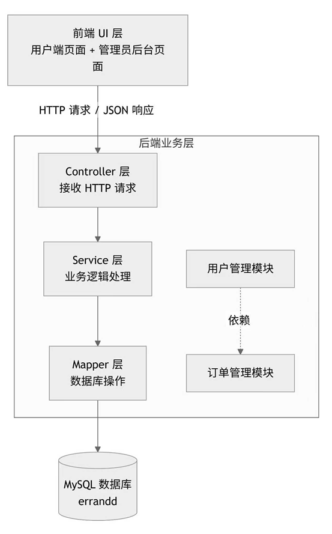

### 2. 模块设计

- **用户管理模块**：负责管理员和普通用户的增删改查，为订单模块提供人员数据支撑。
- **订单管理模块**：负责订单的发布、接单、状态跟踪。订单中的“发起人”和“接单人”字段关联用户表中的用户ID。
- **模块依赖关系**：订单模块依赖用户模块。创建订单时需校验发起人是否存在，接单时需校验接单人是否存在。用户模块是基础，订单模块是核心业务。

### 3. 数据库设计
- E-R 图
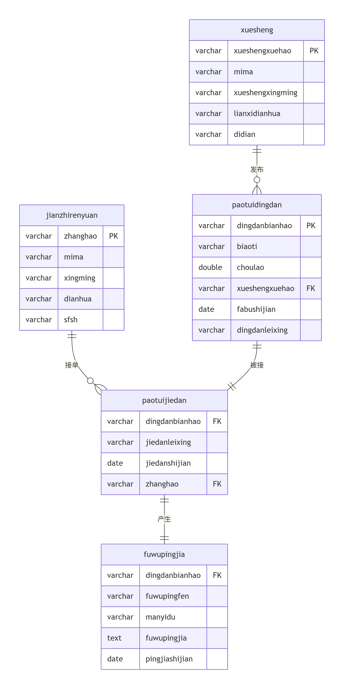
- 主要数据表设计  

| 表名 | 主要字段 | 说明 |
|------|----------|------|
| 学生 (xuesheng) | 学号、密码、姓名、电话、默认地点 | 发布订单的用户 |
| 兼职人员 (jianzhirenyuan) | 账号、密码、姓名、电话、审核状态 | 接单跑腿的用户 |
| 跑腿订单 (paotuidingdan) | 订单编号、标题、酬劳、学生学号、地点、状态、发布时间、需求 | 发布的跑腿任务 |
| 跑腿接单 (paotuijiedan) | 订单编号、酬劳、学生信息、接单时间、接单状态、兼职人员信息 | 谁接了哪个订单及进度 |
| 服务评价 (fuwupingjia) | 订单编号、学生信息、评分、满意度、评价内容、兼职人员信息 | 订单完成后的评价 |
| 管理员 (users) | 用户名、密码、角色 | 系统后台管理 |

订单状态通过“订单类型”或“接单类型”字段标识（如未接/已接/已完成）。跑腿员收入可通过已完成订单的酬劳累计。


---

## 四、系统实现  

### 1. 关键技术
#### 后端部分
| 技术名称 | 用途说明 |
|----------|----------|
| Spring Boot | 项目基础框架，简化Spring应用的搭建和配置 |
| MyBatis-Plus | 数据库操作框架，无需手写SQL即可完成增删改查和分页 |
| RESTful API | 前后端通信规范，使用GET/POST/PUT/DELETE对应查/增/改/删 |
| MySQL | 关系型数据库，存储用户、管理员、订单等数据 |
| HikariCP连接池 | Spring Boot默认数据库连接池，管理数据库连接 |
| Lombok | 简化实体类代码，自动生成getter/setter |
| 统一返回格式Result | 封装后端返回的JSON数据，保证code/message/data结构一致 |

#### 前端部分
**（一）前端页面开发技术**
1. 基础页面构建技术：采用 HTML5 语义化标签（`<header>`、`<section>`、`<form>`等），搭建系统首页、登录页、个人中心等核心页面的结构框架，保证页面结构清晰、可维护性强。
2. CSS 美化技术：运用 CSS3 特性（阴影、圆角、弹性布局），实现统一的 UI 风格；通过固定标签宽度、设置 `white-space: nowrap` 等属性，解决文字换行、排版错乱问题。
3. 交互逻辑实现技术：采用分步式交互设计，通过 JS 控制页面显示与切换，实现业务类型选择、表单提交、页面跳转等交互效果。
**（二）核心样式与布局技术**
1. 卡片式布局技术：运用 CSS 弹性布局（Flexbox），实现页面元素居中、对齐，解决表单标签单行显示、按钮间距优化等问题。
2. 响应式与一致性样式技术：通过统一的 CSS 样式定义（导航栏、卡片样式、按钮样式），保证所有页面 UI 风格统一。
**（三）前端交互与功能实现技术**
1. 表单交互技术：设计表单验证、下拉选择、按钮点击等基础交互，实现输入框、下拉菜单、文本域等元素的美观呈现。
2. 分步交互技术：采用分步式页面设计，通过 JS 控制不同业务页面的显示与切换，避免字段混杂，提升用户操作体验。

### 2. 界面展示

#### 1. 系统首页界面

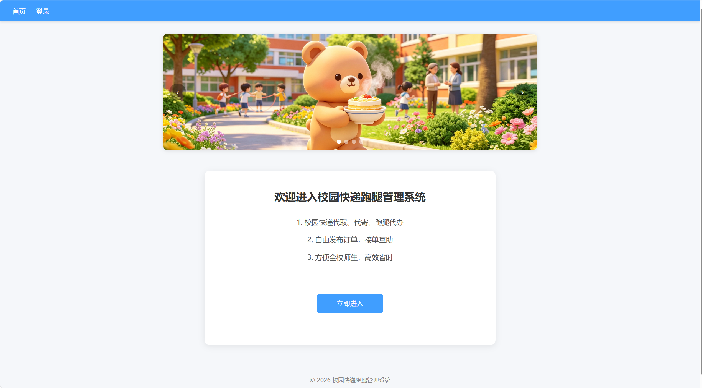

系统首页为项目初始欢迎页面，整体采用统一UI风格设计，页面简洁大方。展示了校园快递代取、代寄、校园跑腿等核心业务介绍，设置导航栏可快速跳转登录、注册、订单等页面，同时配备入口引导按钮，让用户能够直观了解系统功能并快速进入对应模块。

#### 2. 用户登录界面

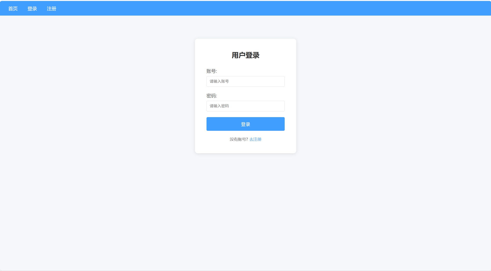

登录界面采用卡片式居中布局，样式美观规整。设置账号、密码输入框，支持用户输入个人账号密码完成系统登录；页面下方设置注册跳转链接，方便未注册新用户快速前往注册页面，整体布局排版对齐工整，与系统整体设计风格保持统一。

#### 3. 用户注册界面

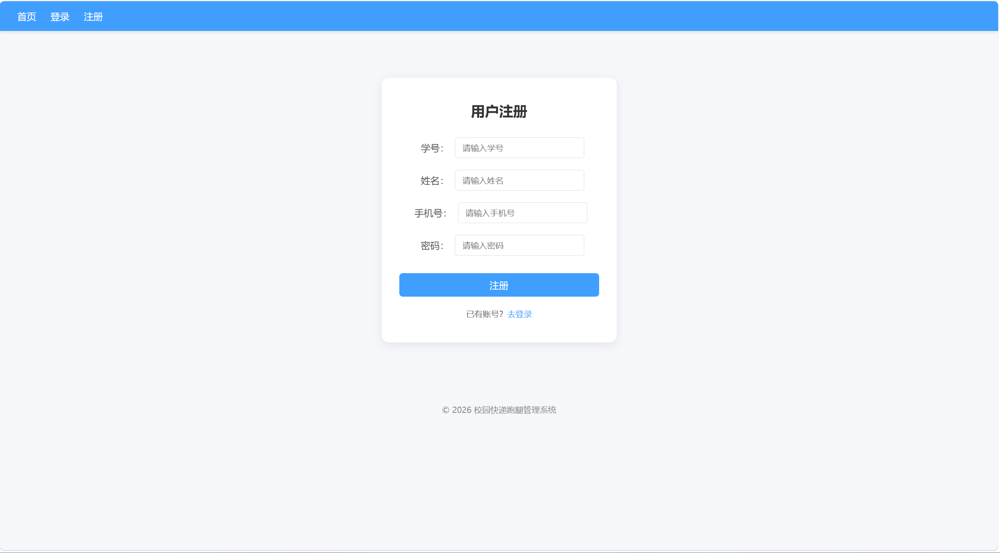

注册界面沿用卡片式设计风格，布局与登录界面保持一致。提供学号、姓名、手机号、密码等注册信息输入项，优化文字排版实现标签文字单行对齐，界面整洁美观。设有登录页面跳转入口，实现注册与登录功能互通，方便用户完成账号注册流程。

#### 4. 全部订单界面

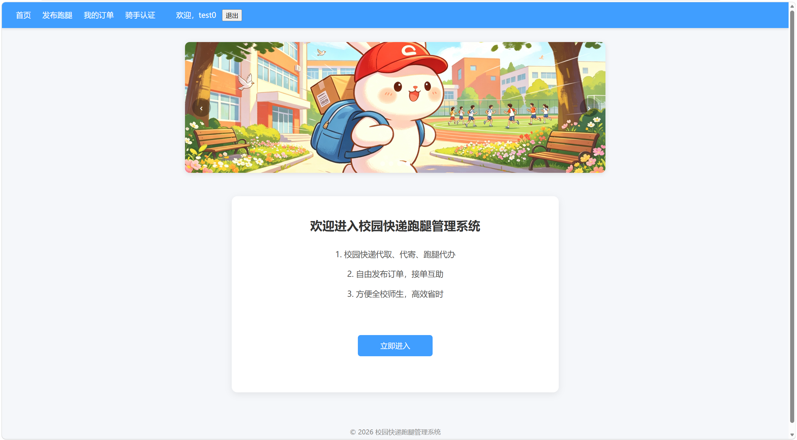

全部订单页面采用独立卡片框选每一条订单信息，界面层次分明。展示订单类型、取送地址、赏金金额、订单状态等核心信息，通过颜色区分待接单、已接单不同状态，搭配接单操作按钮。页面排版整齐，视觉效果简洁舒适，便于用户浏览和接取跑腿订单。

#### 5. 发布跑腿业务选择界面

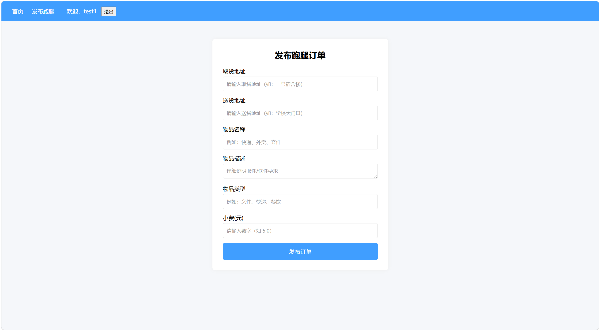

发布功能采用分步交互设计，首页面为业务类型选择页。划分快递代取、快递代寄、校园跑腿三大业务选项，以按钮形式供用户选择，界面逻辑清晰、操作直观。分步设计规避了业务字段混杂问题，贴合实际校园跑腿业务使用逻辑。

#### 6. 快递代取发布界面

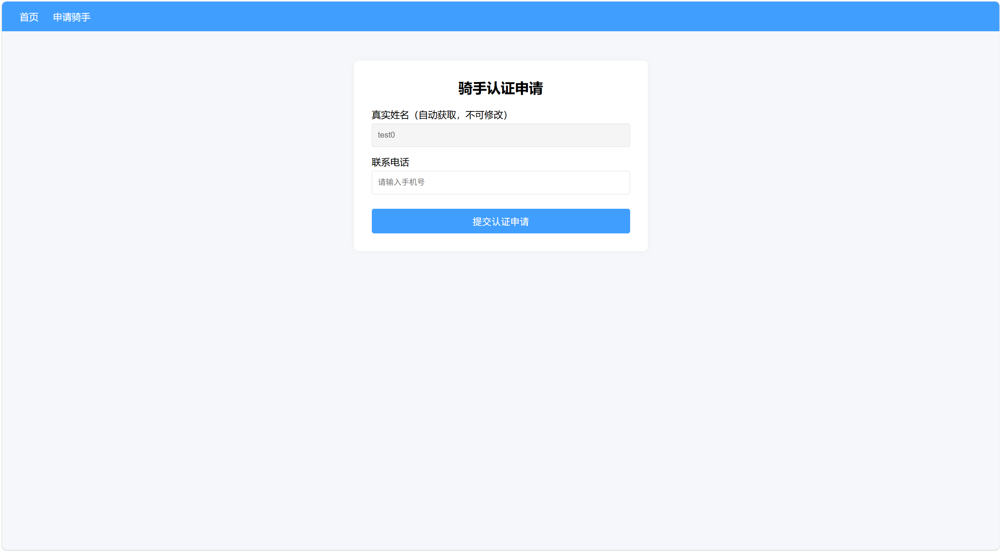

选择快递代取后进入专属发布表单页面，表单标签排版整齐且文字单行显示。设置取件地址、送达地址、赏金、备注等专属填写项，适配快递代取业务场景需求。页面配有提交发布按钮和返回上一步按钮，可完成订单发布或退回业务选择页，交互便捷。

#### 7. 快递代寄发布界面

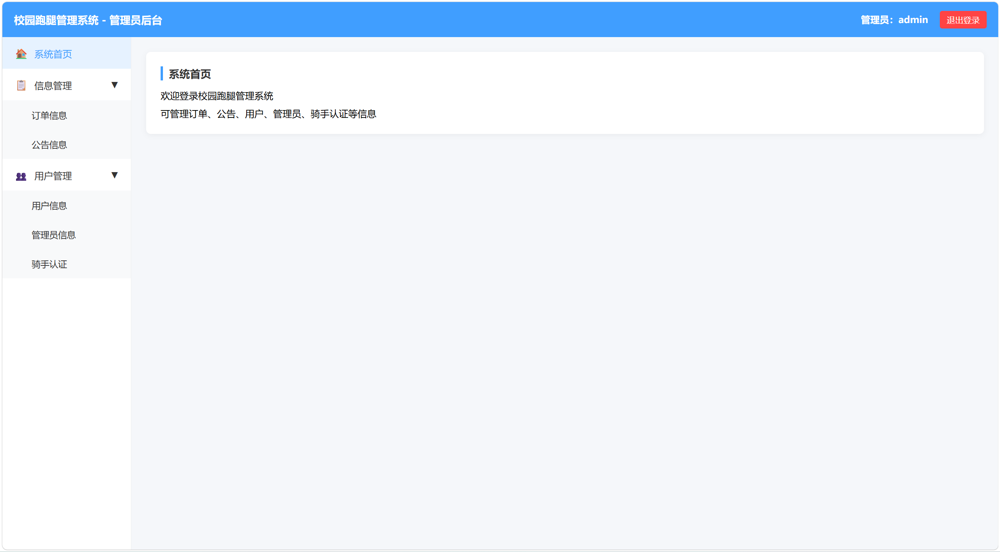

快递代寄发布界面根据业务特性定制表单内容，包含寄件地址、快递公司选择、赏金、备注等填写项，通过下拉框提供多家快递公司可选。界面布局、样式、排版与其他发布页面统一，字段设计贴合快递代寄实际业务流程，结构合理、简洁实用。

#### 8. 校园跑腿发布界面

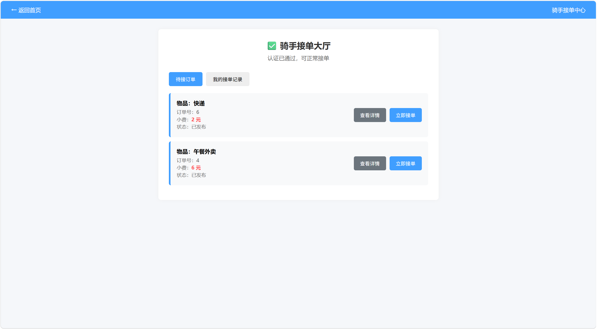

校园跑腿发布界面适配日常校园代办场景，设置起点位置、终点位置、跑腿需求、赏金等表单项。提供买饭、代买、送物品等跑腿类型选择，标签文字全部单行对齐，整体界面美观规整，符合学生日常校园跑腿发布需求。

#### 9. 个人中心界面

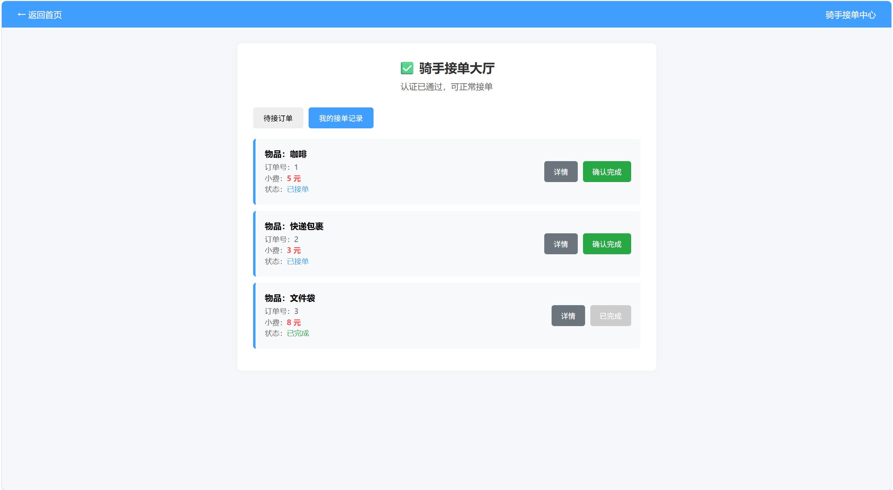

个人中心采用卡片式布局，集中展示用户名、学号、手机号、发布订单数、已接单数量等个人信息。设置我的订单、退出登录功能按钮，优化按钮间距解决留白过多问题，排版紧凑协调。功能分区明确，方便用户查看个人资料、管理订单及退出系统。

### 3. 核心代码片段

#### 后端代码片段

**片段一：业务层分页查询（AdminServiceImpl.java）**  
说明：该方法位于 Service 层，负责管理员列表的分页查询和模糊搜索，体现了 MyBatis-Plus 无需手写 SQL 即可完成复杂查询。
```java
@Service
public class AdminServiceImpl extends ServiceImpl<AdminMapper, Admin> 
        implements IAdminService {
    @Override
    public Page<Admin> getAdminPage(int pageNum, int pageSize, 
                                    String username, String nickname) {
        // 构建查询条件包装器
        LambdaQueryWrapper<Admin> wrapper = new LambdaQueryWrapper<>();
        // 按账号模糊搜索（若前端传了值）
        wrapper.like(StringUtils.hasText(username), Admin::getUsername, username);
        // 按姓名模糊搜索（若前端传了值）
        wrapper.like(StringUtils.hasText(nickname), Admin::getNickname, nickname);
        // 按创建时间倒序排列
        wrapper.orderByDesc(Admin::getCreateTime);
        // 创建分页对象，pageNum当前页，pageSize每页条数
        Page<Admin> page = new Page<>(pageNum, pageSize);
        return this.page(page, wrapper);
    }
}
```
**片段二：控制器层管理员接口（AdminController.java）**  
说明：该接口遵循 RESTful 风格，处理前端 GET 请求，调用 Service 获取分页数据，并返回统一 JSON 格式。
```java
@RestController
@RequestMapping("/api/admin")
public class AdminController {
    @Autowired
    private IAdminService adminService;

    @GetMapping("/list")
    public Result<Page<Admin>> list(
            @RequestParam(defaultValue = "1") Integer pageNum,
            @RequestParam(defaultValue = "10") Integer pageSize,
            @RequestParam(required = false) String username,
            @RequestParam(required = false) String nickname) {
        // 调用 Service 分页查询，并用统一返回类封装
        Page<Admin> page = adminService.getAdminPage(pageNum, pageSize, 
                                                    username, nickname);
        return Result.success(page);
    }
}
```
**片段三：数据库连接与 MyBatis-Plus 配置（application.yml）**  
说明：该配置文件定义了后端项目连接 MySQL 数据库的参数，以及 MyBatis-Plus 的实体扫描和 SQL 日志输出，是项目启动的基础。
```yaml
spring:
  datasource:
    driver-class-name: com.mysql.cj.jdbc.Driver
    url: jdbc:mysql://localhost:3306/errandd?useSSL=false&serverTimezone=Asia/Shanghai&characterEncoding=UTF-8
    username: root
    password: 12345

mybatis-plus:
  configuration:
    log-impl: org.apache.ibatis.logging.stdout.StdOutImpl  # 控制台打印SQL，调试用
  type-aliases-package: com.example.errand3.entity          # 实体类包路径
```

#### 前端代码片段

**片段一：全局公共样式（统一系统UI风格）**
说明：该代码为所有页面共用样式，实现导航栏、卡片、全局布局统一，解决页面杂乱、风格不统一问题，是前端美化的核心基础。
```css
/* 全局样式重置，避免浏览器默认样式差异 */
* {
    margin: 0;
    padding: 0;
    box-sizing: border-box;
    font-family: "Microsoft YaHei", sans-serif;
}

/* 页面背景样式，提升视觉舒适度 */
body {
    background-color: #f5f7fa;
    min-height: 100vh;
}

/* 导航栏样式（所有页面共用） */
.nav {
    background-color: #409eff;
    padding: 15px 30px;
    box-shadow: 0 2px 5px rgba(0, 0, 0, 0.1);
}

.nav a {
    color: white;
    text-decoration: none;
    margin-right: 20px;
    font-size: 16px;
}

.nav a:hover {
    color: #ffd04b;
}

/* 卡片公共样式（登录、注册、个人中心共用） */
.login-card {
    max-width: 400px;
    margin: 80px auto;
    background: white;
    padding: 40px 30px;
    border-radius: 12px;
    box-shadow: 0 4px 15px rgba(0, 0, 0, 0.08);
    text-align: center;
}
```
**片段二：表单排版核心代码（解决文字换行、不对齐问题）**  
说明：针对注册页、发布订单页标签文字换行问题，优化表单布局，实现所有标签单行对齐，提升页面整洁度。
```html
<!-- 表单结构（登录、注册、发布订单页面共用） -->
<div class="form-item">
    <label>用户名</label>
    <input type="text">
</div>
```
```css
/* 表单标签对齐核心样式，强制文字不换行 */
.form-item {
    display: flex;
    align-items: center;
    margin-bottom: 20px;
    justify-content: center;
}
.form-item label {
    width: 90px;
    min-width: 90px;
    max-width: 90px;
    text-align: right;
    margin-right: 10px;
    color: #555;
    font-size: 16px;
    white-space: nowrap !important;
}
.form-item input,
.form-item select,
.form-item textarea {
    width: 220px;
    padding: 8px 12px;
    border: 1px solid #ddd;
    border-radius: 4px;
    font-size: 14px;
}
```
**片段三：订单列表卡片核心代码（美化订单界面）**  
说明：按照需求实现“每个订单用框框起来”，采用卡片式设计，区分订单状态，提升订单列表可读性。
```css
/* 订单列表容器样式 */
.order-container {
    max-width: 700px;
    margin: 50px auto;
    padding: 0 20px;
}
/* 订单卡片样式（每个订单独立框选） */
.order-card {
    background: white;
    border-radius: 12px;
    box-shadow: 0 4px 15px rgba(0, 0, 0, 0.08);
    padding: 25px 30px;
    margin-bottom: 20px;
}
/* 订单信息项排版 */
.order-item {
    display: flex;
    justify-content: center;
    margin: 10px 0;
    font-size: 16px;
}
/* 订单状态区分（待接单/已接单） */
.status-pending {
    color: #e6a23c;
}
.status-done {
    color: #67c23a;
}
/* 接单按钮样式 */
.order-btn {
    display: block;
    width: 120px;
    height: 35px;
    line-height: 35px;
    background-color: #409eff;
    color: white;
    border: none;
    border-radius: 6px;
    margin: 15px auto 0;
    cursor: pointer;
}
```
**片段四：分步发布跑腿交互代码（核心交互逻辑）**  
说明：按照需求实现“先选业务类型，再进入对应发布界面”，采用分步切换逻辑，避免字段混杂，提升用户体验。
```html
<!-- 第一步：业务类型选择界面 -->
<div id="step1" class="step-card active">
    <h3>请选择业务类型</h3>
    <button onclick="go('step2')">快递代取</button>
</div>
<!-- 第二步：快递代取发布界面（示例） -->
<div id="step2" class="step-card">
    <h3>快递代取</h3>
    <!-- 表单内容 -->
    <button onclick="go('step1')">返回</button>
</div>
```
```javascript
// 分步切换核心逻辑（JS交互）
function go(id) {
    document.querySelectorAll('.step-card').forEach(card => {
        card.classList.remove('active');
    });
    document.getElementById(id).classList.add('active');
}
```
**片段五：个人中心优化代码（解决按钮留白过多问题）**  
说明：优化个人中心“我的订单”与“退出登录”按钮间距，解决留白过多、不美观问题。
```css

/* 个人中心卡片样式 */
.profile-card {
    max-width: 400px;
    margin: 80px auto;
    background: white;
    padding: 40px 30px;
    border-radius: 12px;
    box-shadow: 0 4px 15px rgba(0, 0, 0, 0.08);
    text-align: center;
}
/* 个人中心按钮样式（优化间距） */
.profile-btn {
    width: 160px;
    height: 45px;
    line-height: 45px;
    background-color: #409eff;
    color: white;
    border-radius: 6px;
    margin: 10px auto;
    border: none;
    cursor: pointer;
}
/* 退出登录按钮区分样式 */
.profile-btn:nth-child(7) {
    background-color: #f56c6c;
}
```


---

## 五、系统测试  

### 1. 测试方案
（待测试同学跟进完善）

### 2. 测试结果
（待结项补充）

### 3. 问题与改进
（待结项补充）

---

## 六、用户手册  

### 1. 安装部署说明
（待结项补充）

### 2. 操作指南
（待结项补充）

---

## 七、项目总结  

### 1. 成果总结
#### 后端成果
- 搭建了基于 Spring Boot + MyBatis-Plus + MySQL 的后端项目框架
- 完成了用户管理模块的全部后端接口，包括管理员和普通用户的增删改查、分页查询、模糊搜索、批量删除
- 前后端通过 RESTful API 通信，返回统一 JSON 格式数据
#### 前端成果
- 完成系统所有页面的布局与美化，包括首页、登录页、注册页、订单页、个人中心等核心模块，实现了界面风格统一、排版规范，解决了标签换行、按钮间距等问题
- 完成前端界面的全流程开发，从首页引导、登录验证、业务选择，到订单展示、订单发布，所有页面均保持统一的 UI 风格，确保交互流畅、操作便捷
- 优化前端布局细节，实现了所有界面的风格统一、排版整齐，为后续后端接口对接、功能完善奠定了坚实基础

### 2. 不足与改进方向

目前的不足：
- 订单管理模块尚未完成，当前仅完成用户管理模块
- 密码以明文存储，未使用加密算法
- 缺少统一的异常处理，错误信息不够友好
- 未进行单元测试，仅做了手动接口测试
- 界面视觉丰富度不足，缺少图片、图标等元素，整体略显单调
- 交互体验不完善，缺乏输入提示、错误反馈等细节
- 部分页面存在排版偏差和留白过多的问题
- 部分表单字段选项不够贴合实际使用场景

改进方向：
- 继续完成订单管理模块的后端接口
- 密码改用 BCrypt 等加密算法存储
- 引入全局异常处理器，统一处理各类错误
- 补充单元测试，提高代码质量
- 增加图片、图标等视觉元素，提升界面美观度
- 完善交互设计，增加输入提示和错误反馈
- 统一调整页面排版细节，消除偏差并精简留白
- 根据实际场景优化表单字段选项，增强实用性

### 3. 成员分工表
| 姓名 | 班级 | 学号 | git账号 | 主要任务 |
|------|------|------|---------|----------|
| 蒋奕婷 | 计算机科学与技术4班 | 202405567328 | miku0831-01 | 组长、项目统筹、文档撰写、汇报 |
| 唐雪凝 | 计算机科学与技术4班 | 202405567326 | ttxnn46 | 前端页面开发、调用API |
| 周文瑶 | 计算机科学与技术4班 | 202405567303 | oowzdl | 后端接口、业务逻辑 |
| 宁钰莹 | 计算机科学与技术4班 | 202405567325 | ning413 | 数据库设计、测试 |


### 4. Git 提交记录
（待结项补充）

---

## 附录  

- 参考资料
- 源代码仓库链接  
https://github.com/30CampusExpress/campus-express
- 其他补充材料
